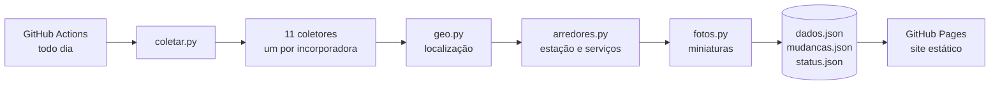

<div align="center">


# NaPlanta

**Mapa gratuito de lançamentos imobiliários na planta**<br>
Foco em Mogi das Cruzes e no Alto Tietê, cobrindo também a Grande São Paulo e outras capitais.

[](https://yh3rcul3sy.github.io/naplanta/)
[](https://github.com/yH3rcul3Sy/naplanta/actions/workflows/coleta.yml)


**[Acessar o site](https://yh3rcul3sy.github.io/naplanta/)** · [Sobre os dados](https://yh3rcul3sy.github.io/naplanta/transparencia.html) · [Como funciona](#como-funciona)

</div>

---

Os dados vêm **direto dos sites das próprias incorporadoras** e são atualizados **automaticamente todo dia**. Cada empreendimento leva à página oficial, sem corretor nem intermediário.

> Projeto acadêmico da Universidade de Mogi das Cruzes (UMC), submetido ao UMC Summit.

## Destaques

| | |
|---|---|
| 🗺️ **Mapa e lista** | Mais de 900 empreendimentos de 11 incorporadoras. Por padrão mostra só o que está **na planta** (breve lançamento, lançamento e em obras); os prontos aparecem com a opção "Prontos". |
| 🔎 **Filtros** | Cidade, tipo (apartamento, casa em condomínio, lote), etapa, construtora, dormitórios, área mínima e distância até a estação. |
| 🚆 **Arredores** | Estação de trem ou metrô em operação mais próxima (até 3 km) e escolas, saúde, mercados e parques a até 1 km. |
| 🆕 **O que mudou** | Lançamentos novos, mudanças de etapa e empreendimentos que saíram, comparando cada coleta com a do dia anterior. |
| 📋 **Sobre os dados** | Situação de cada fonte, data da última coleta, regras e limites, tudo à vista. |
| 📱 **Celular** | Layout próprio para telas pequenas e pode ser adicionado à tela inicial como um app. |

## Como funciona



1. **Coleta:** cada coletor lê as páginas públicas de uma incorporadora e extrai nome, etapa, endereço, dormitórios, área, entrega e foto.
2. **Localização:** a coordenada da fonte é conferida no [Nominatim](https://nominatim.org/). Se o ponto cai fora da cidade, o endereço é procurado de novo. O pino vai para o prédio de mesmo nome no OpenStreetMap quando ele existe. Sem posição confiável, o pino fica no bairro, com aviso de "localização aproximada".
3. **Arredores:** estação e serviços próximos vêm do OpenStreetMap, pela API [Overpass](https://overpass-api.de/).
4. **Fotos:** cada foto é baixada uma vez e vira uma miniatura WebP servida pelo próprio site.
5. **Publicação:** o site é um único `index.html` que lê o `dados.json` e desenha o mapa com Leaflet. Não há servidor nem banco de dados.

## Regras da coleta

- ✅ Só lê o que o `robots.txt` de cada site permite. **Bloqueios nunca são contornados.**
- ✅ Identifica-se como `NaPlantaBot/0.1 (projeto academico UMC)` e espera 1 segundo entre páginas.
- ✅ Guarda só informações públicas do empreendimento. **Não coleta preços nem dados pessoais.**
- ✅ Empreendimentos 100% vendidos ficam de fora.
- ✅ Se um site falha, responde vazio ou perde mais de 30% dos empreendimentos de um dia para o outro, os dados anteriores são mantidos.

## Fontes

| Incorporadora | Região principal |
|---|---|
| Helbor | Mogi das Cruzes, São Paulo e outras capitais |
| C.A.C Engenharia | Mogi das Cruzes |
| Integra Urbano | Mogi das Cruzes e Suzano |
| Sousa Araujo | Mogi das Cruzes e interior de SP |
| Damebe | Mogi das Cruzes |
| Cury | São Paulo e Rio de Janeiro |
| Tenda | Diversas capitais |
| EZTEC | São Paulo, Guarulhos, Osasco e ABC |
| Econ | São Paulo e Guarulhos |
| Metrocasa | São Paulo |
| Vibra Residencial | São Paulo |

<details>
<summary><b>Incorporadoras que ficaram de fora</b></summary>
<br>

| Incorporadora | Motivo |
|---|---|
| MRV | O `robots.txt` proíbe a coleta das páginas de imóveis |
| Plano&Plano | O `robots.txt` proíbe a coleta das páginas de empreendimentos |
| Habras | O site bloqueia acessos automatizados |
| Cyrela | O site bloqueia acessos automatizados |

Cury e Sousa Araujo não respondem às coletas feitas pelos servidores do GitHub; os dados delas são atualizados quando a coleta roda localmente.

</details>

## Rodar localmente

Requer **Python 3.12** ou mais novo.

```bash
pip install -r coleta/requirements.txt
python coleta/coletar.py
python -m http.server 8000 --directory site
```

Depois é só abrir http://localhost:8000. A primeira coleta demora mais, porque preenche os caches de localização e arredores e gera as miniaturas.

<details>
<summary><b>Estrutura do projeto</b></summary>
<br>

```
coleta/
  coletar.py           orquestra a coleta e detecta mudanças
  <incorporadora>.py   um coletor por fonte (coletar() e parse())
  geo.py               localização e conferência de coordenadas
  arredores.py         estação e serviços próximos
  fotos.py             miniaturas das fotos
site/
  index.html           mapa, lista, filtros e painel de novidades
  transparencia.html   página "Sobre os dados"
  dados.json           empreendimentos (gerado)
  mudancas.json        histórico de mudanças, 180 dias (gerado)
  status.json          situação de cada fonte (gerado)
  fotos/               miniaturas (geradas)
.github/workflows/coleta.yml   coleta diária e publicação
```

</details>

<details>
<summary><b>Limites conhecidos</b></summary>
<br>

- A etapa da obra é a que a incorporadora informa no site dela.
- Alguns pinos são aproximados: ficam na rua ou no bairro quando nem a fonte nem o OpenStreetMap têm a posição do prédio. O card avisa quando o pino está no bairro.
- As distâncias até estações e serviços são em linha reta, não o caminho a pé.

</details>

## Tecnologias

Todas gratuitas e abertas: **Python** (httpx, BeautifulSoup, Pillow), **Leaflet** com Leaflet.markercluster, **OpenStreetMap** (mapa, Nominatim e Overpass), **GitHub Actions** e **GitHub Pages**.

## Direitos

© 2026 autores do NaPlanta. **Todos os direitos reservados.** O código está visível para fins acadêmicos e de transparência; uso, cópia ou redistribuição dependem de autorização dos autores.

Os dados de mapa são © colaboradores do [OpenStreetMap](https://www.openstreetmap.org/copyright) (ODbL). Nomes, informações e fotos dos empreendimentos pertencem às respectivas incorporadoras.
