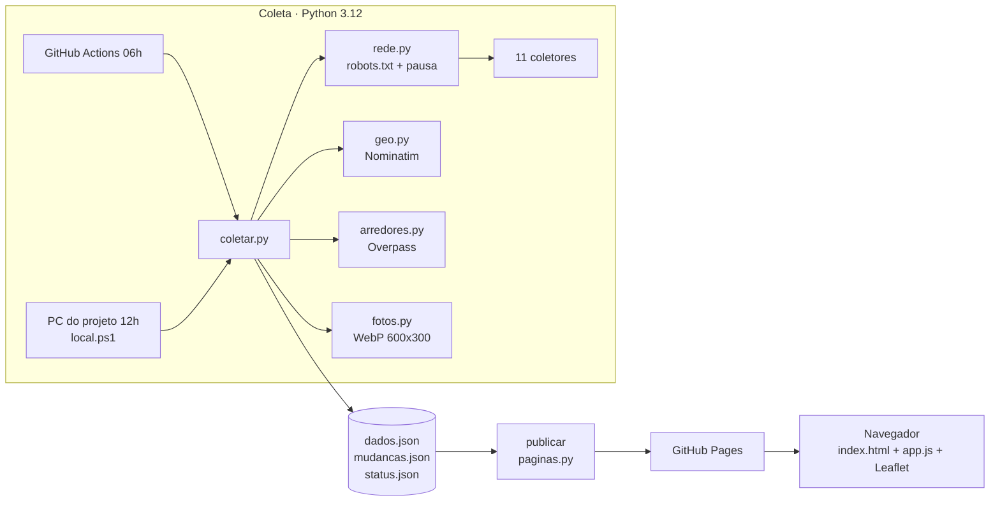

# TRD · NaPlanta

> Documento de requisitos técnicos. Versão 1.0 · outubro de 2026.

## 1. Arquitetura

Tudo em lote: um robô gera arquivos JSON por dia e um site estático os lê. **Não há servidor de aplicação nem banco de dados.**



## 2. Componentes

| Componente | Tecnologia | Responsabilidade |
|---|---|---|
| `coleta/coletar.py` | Python, stdlib | Orquestra: coleta, valida, compara com ontem e grava os JSON |
| `coleta/rede.py` | httpx | Único acesso aos sites: `robots.txt`, User-Agent, pausa de 1 s |
| `coleta/<fonte>.py` | httpx e BeautifulSoup | `coletar()` devolve a lista de empreendimentos. `parse()` lê uma página |
| `coleta/geo.py` | Nominatim (OSM) | Confere e corrige coordenadas e põe o pino no prédio de mesmo nome |
| `coleta/arredores.py` | Overpass (OSM) | Estação mais próxima (3 km) e serviços (1 km) |
| `coleta/fotos.py` | Pillow | Baixa uma vez e gera miniatura WebP |
| `coleta/paginas.py` | stdlib | Páginas por empreendimento e `sitemap.xml`, geradas na publicação |
| `coleta/local.ps1` | PowerShell | Coleta diária no PC (fontes que barram o GitHub) |
| `site/index.html` + `app.js` | Leaflet 1.9 e markercluster | Mapa, lista, filtros, novidades |
| `.github/workflows/coleta.yml` | GitHub Actions | Coleta agendada e publicação |

## 3. Contrato dos coletores

Cada módulo de fonte expõe:

```python
BASE = 'https://site-da-incorporadora.com.br'   # todo 'fonte' precisa começar com BASE + '/'
def coletar() -> list[dict]                     # usa rede.cliente()
```

Cada empreendimento devolvido precisa ter `nome`, `construtora`, `etapa`, `fonte` e `texto` (usado para inferir o tipo), e opcionalmente `endereco`, `cidade`, `uf`, `lat`, `lng`, `dorms`, `m2`, `entrega` e `imagem`. `coletar.problemas()` valida o formato. Sem nome ou link, o item é descartado. Com outro campo inválido, só esse campo é esvaziado.

**Para adicionar uma fonte:** crie `coleta/<fonte>.py` com `BASE` e `coletar()`, inclua na lista `FONTES` de `coletar.py`, confira o `robots.txt` e rode a coleta localmente.

## 4. Regras de robustez

| Situação | Comportamento |
|---|---|
| Fonte devolve 0 itens | Falha da fonte: mantém a coleta anterior, `ok: false` |
| Fonte cai mais de 30% num dia | Tratada como incompleta. Aceita se repetir por 3 coletas seguidas |
| Exceção em uma fonte | Isolada: as outras seguem |
| Nominatim fora do ar (3 tentativas) | A coleta toda para sem gravar nada, e o site continua com a de ontem |
| Overpass fora do ar | Pula o bloco e completa nos próximos dias (orçamento de 600 s por coleta) |
| Foto não baixa | Card sem foto e nova tentativa no dia seguinte |
| Push da coleta conflita | `git pull --rebase` antes do push |

## 5. Segurança

- **Entrada não confiável:** todo texto das fontes é escapado no navegador (`esc()`) e na geração das páginas (`html.escape`, JSON-LD com `<` escapado).
- **Links:** `fonte` precisa começar com `BASE + '/'`, então não aceita `javascript:` nem domínio falso.
- **CSP:** `script-src 'self'` (sem inline) e CDN só com SRI. As páginas geradas usam `script-src 'none'`.
- **Actions:** permissões mínimas por job e actions fixadas por SHA, com o Dependabot atualizando.
- **Sem segredos:** não há API paga, banco nem login.

## 6. Desempenho

| Item | Tamanho ou tempo |
|---|---|
| `dados.json` | cerca de 440 KB (70 KB com gzip) |
| Fotos | WebP 600×300 com qualidade 62, cerca de 20 KB cada, carregadas sob demanda |
| Lista | Renderiza em lotes de 30 conforme a rolagem |
| Pinos | `addLayers` em lote, agrupando só pinos no mesmo lugar (3 m) |
| Coleta completa | 20 a 40 min. Caches de geo e arredores evitam consultas repetidas |

## 7. Ambientes

| Ambiente | Como rodar |
|---|---|
| Local | `pip install -r coleta/requirements.txt`, `python coleta/coletar.py`, `python coleta/paginas.py`, `python -m http.server -d site` |
| Produção | Push na `main` publica. Coleta às 06h (Actions) e às 12h (PC) |

## 8. Testes

Autotestes com `assert` no carregamento de cada módulo (`python -c "import coletar"` roda todos). Eles cobrem a validação de campos, a comparação entre dias, a detecção de queda, a geocodificação (`geohash`, bairro, nome do prédio), as estações em operação, o `robots.txt` e o escape das páginas.

**Lacuna:** não há testes de `parse()` com HTML salvo de cada fonte (ver plano de implementação).

## 9. Limites conhecidos

- O parser de `robots.txt` do Python não entende curingas (`*`, `$`). Nenhuma fonte usa hoje.
- Distâncias em linha reta.
- Cury e Sousa Araujo dependem do PC do projeto ligado.
- Os caches de geo e arredores não expiram (apagar o arquivo refaz tudo).
