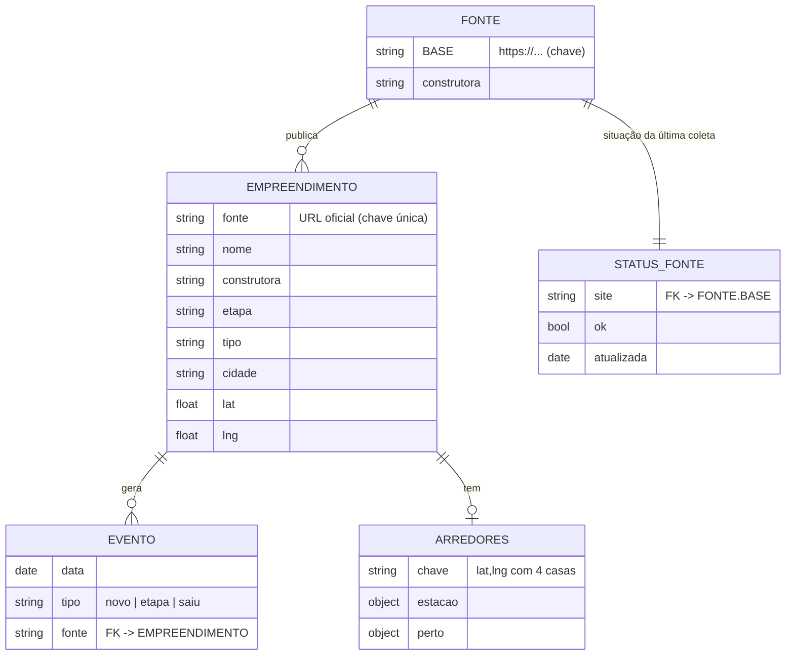

# Esquema do backend · NaPlanta

O "backend" são arquivos JSON versionados no git, gerados pela coleta e servidos como estáticos. Não há banco nem API.



## `site/dados.json`: lista de empreendimentos

A chave é `fonte` (URL oficial), que é o que liga um empreendimento entre dias.

| Campo | Tipo | Exemplo | Origem |
|---|---|---|---|
| `fonte` | string (URL) | `https://helbor.com.br/empreendimentos/americas-19` | coletor |
| `nome` | string | `Américas 19` | coletor |
| `construtora` | string | `Helbor` | coletor |
| `etapa` | enum | `Breve lançamento` · `Lançamento` · `Em obras` · `Pronto para morar` | coletor, padronizado |
| `tipo` | enum | `Apartamento` · `Casa em condomínio` · `Lote` | inferido do texto |
| `endereco` | string? | `Av. das Américas, 19000...` | coletor |
| `cidade`, `uf` | string? | `Rio de Janeiro`, `RJ` | coletor ou Nominatim |
| `lat`, `lng` | float? | `-23.01`, `-43.46` | coletor, conferido e corrigido no `geo.py` |
| `aprox` | `"bairro"`? | | pino no bairro, não no endereço |
| `dorms` | [min, max]? | `[2, 3]` | coletor |
| `m2` | [min, max]? | `[54.0, 136.0]` | coletor |
| `entrega` | string? | `Dez/2027` | coletor |
| `imagem` | string? | `fotos/ae40e27e0a18f3d4.webp` | `fotos.py` (sha1 da URL original) |
| `desde` | date? | `2026-10-10` | primeira coleta em que apareceu (`null` se a fonte é nova) |
| `estacao` | objeto? | `{"nome":"Estudantes","tipo":"trem","km":2.2}` | `arredores.py` |
| `perto` | objeto | `{"escolas":4,"saude":1,"mercados":2,"parques":2}` | `arredores.py` (1 km) |
| `pagina` | string | `americas-19-rio-de-janeiro-f0ba` | **só no publicado**, por `paginas.py` |

## `site/mudancas.json`: histórico (180 dias)

```json
{ "inicio": "2026-09-25",
  "eventos": [ { "data": "2026-10-10", "tipo": "etapa", "de": "Lançamento", "etapa": "Em obras",
                 "nome": "...", "construtora": "...", "cidade": "...", "uf": "SP", "fonte": "https://..." } ] }
```

Os eventos ficam do mais novo para o mais antigo. `de` só existe em `tipo: "etapa"`.

## `site/status.json`: saúde das fontes

```json
{ "coleta": "2026-10-10T12:14-03:00",
  "fontes": [ { "site": "https://cury.net", "construtora": "Cury", "total": 223, "ok": true,
                "atualizada": "2026-10-10", "erro": "só se ok=false", "quedas": "só se houver queda" } ] }
```

## Caches (em `coleta/`, versionados)

| Arquivo | Chave | Valor | Validade |
|---|---|---|---|
| `geo_cache.json` | `caminho + parâmetros` do Nominatim | resposta JSON | não expira |
| `arredores_cache.json` | `"lat,lng"` com 4 casas | `{estacao, perto}` | não expira |

## Arquivos gerados na publicação (fora do git)

| Caminho | Conteúdo |
|---|---|
| `site/e/<pagina>.html` | uma página por empreendimento, com JSON-LD `Residence` |
| `site/e/index.html` | lista por cidade |
| `site/sitemap.xml` | todas as URLs |

## Quando migrar para um banco

Só quando houver **dado gerado por usuário**, como inscrições em alertas, favoritos ou contas. Sugestão: **Supabase (Postgres)**, com camada gratuita e API pronta. As tabelas seriam `empreendimentos` e `eventos`, espelhando os JSON acima, mais `alertas (email, filtros jsonb, criado_em, confirmado)`. Os JSON continuariam sendo a fonte do mapa, porque são mais rápidos e mais baratos.
