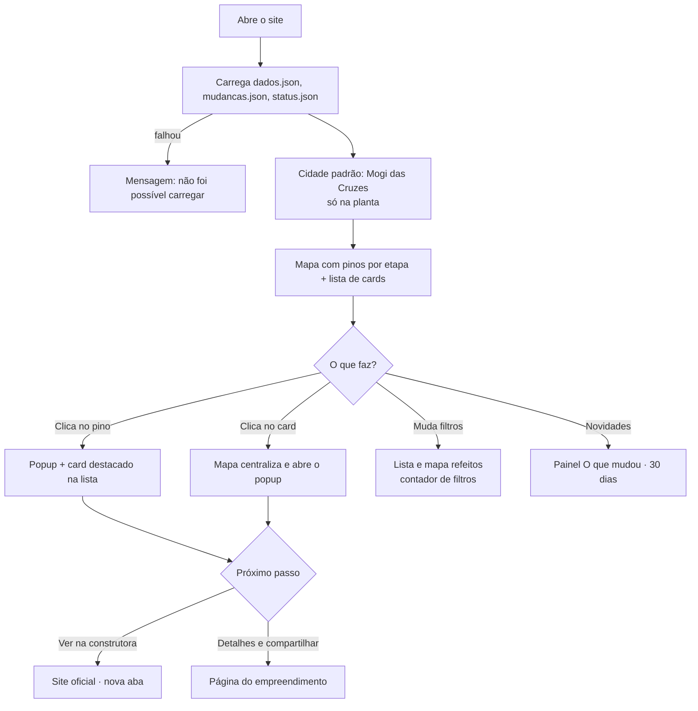
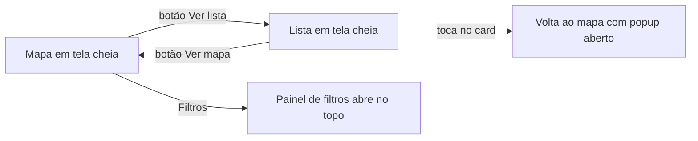
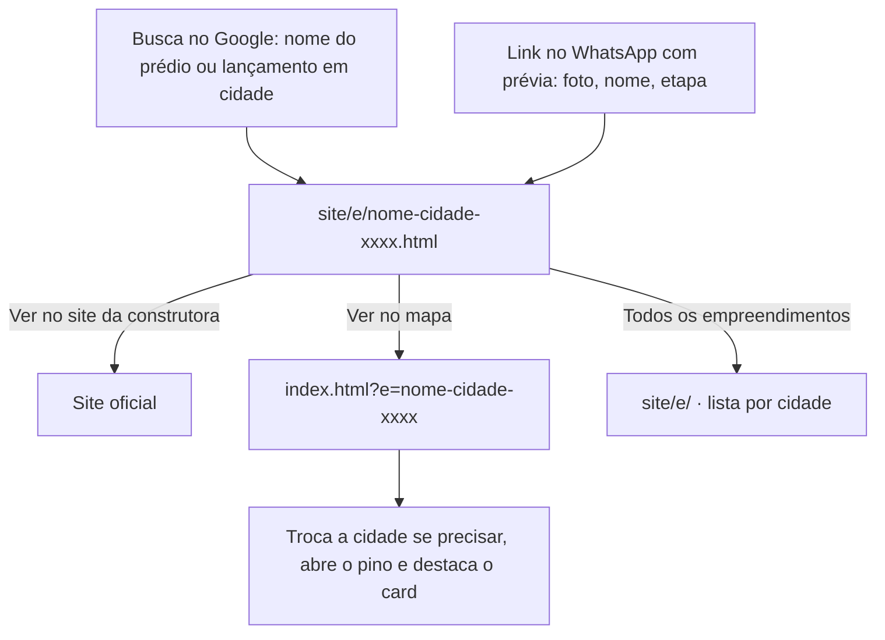
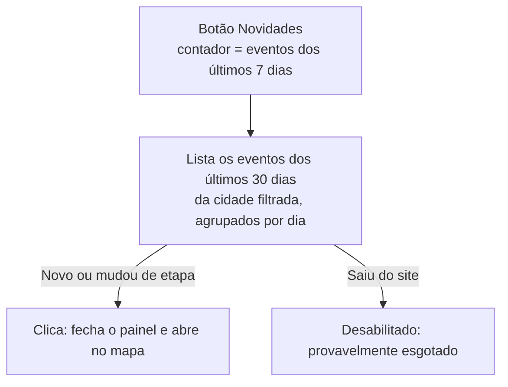
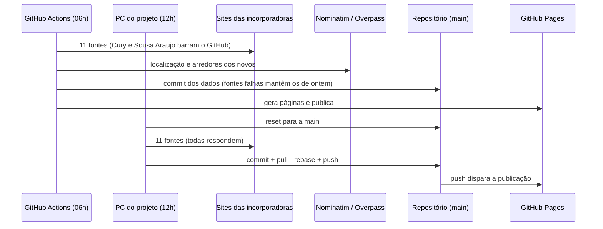
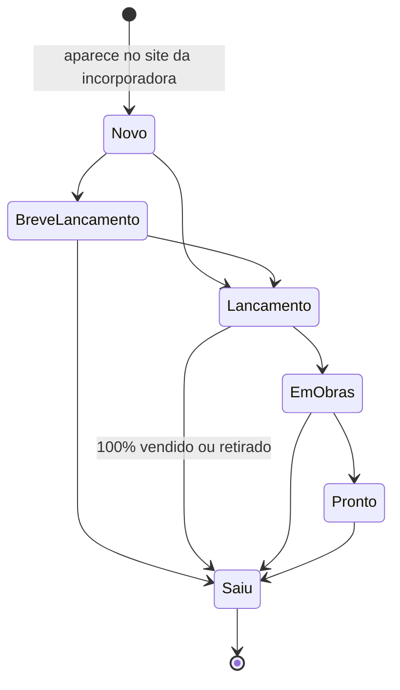

# Fluxos do app · NaPlanta

## 1. Primeira visita (mapa)

## 2. Celular

## 3. Vindo do Google ou de um link compartilhado

## 4. Painel "O que mudou"

## 5. Coleta diária (bastidores)

## 6. Estados de um empreendimento

Cada transição vira um evento em `mudancas.json` (`novo`, `etapa` ou `saiu`), guardado por 180 dias.
